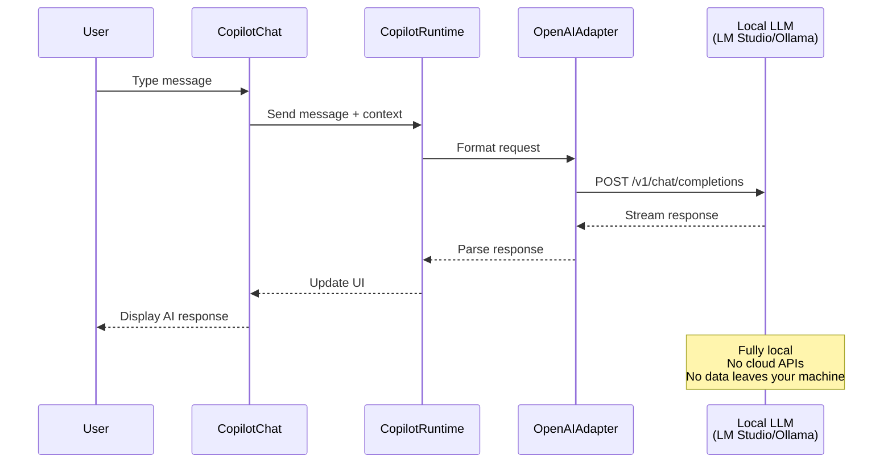
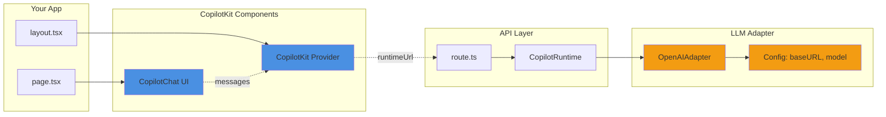

# CopilotKit Quickstart with Local LLM Integration

This is a [Next.js](https://nextjs.org) project integrated with [CopilotKit](https://copilotkit.ai) that supports local LLM providers (LM Studio or Ollama) as alternatives to cloud-based APIs.

**Based on**: [CopilotKit Built-In Agent Quickstart](https://docs.copilotkit.ai/built-in-agent/quickstart)

This repository includes fixes and modifications to enable seamless integration with local LLM providers, bypassing corporate network restrictions and enabling fully offline AI chat functionality.

**Author**: Glenn Mossy - Booz Allen Hamilton, Software Engineer

---

## What is CopilotKit?

[CopilotKit](https://copilotkit.ai) is the **frontend stack for AI agents** - a powerful open-source framework that connects any AI agent framework or model to your React application. It enables developers to build sophisticated AI-powered features including chat interfaces, generative UI, canvas experiences, and human-in-the-loop workflows.

### Core Capabilities

**CopilotKit provides:**
- 🤖 **AI Chat Interfaces** - Drop-in chat components with conversation history and context awareness
- 🔌 **Universal Agent Integration** - Connect OpenAI, Anthropic, Google, or any OpenAI-compatible API
- 🎨 **Generative UI** - AI that can render React components dynamically based on context
- 🔧 **Function Calling** - Enable AI to trigger actions in your application
- 📝 **Context Management** - Automatically provide relevant application state to the AI
- 🎯 **Human-in-the-Loop** - Request user approval for sensitive operations
- 🌐 **Self-Hosted & Cloud** - Deploy anywhere with full control over your data

### Use Cases

- **Customer Support Assistants** - Context-aware chatbots that understand your app's state
- **Content Generation Tools** - AI-powered writing, editing, and creation workflows
- **Data Analysis Interfaces** - Natural language queries over your application data
- **Workflow Automation** - AI agents that can navigate and perform tasks in your UI
- **Code Assistants** - IDE-like experiences with AI code completion and suggestions
- **Local-First AI** - Privacy-focused deployments with local LLMs (LM Studio, Ollama)

---

## Architecture Overview

### System Architecture

This project demonstrates CopilotKit's integration with local LLM providers, eliminating cloud dependencies:

```mermaid
graph TB
    subgraph "Frontend (React/Next.js)"
        A[User Interface]
        B[CopilotChat Component]
        C[CopilotKit Provider]
    end
    
    subgraph "Backend (Next.js API Route)"
        D[/api/copilotkit]
        E[CopilotRuntime]
        F[OpenAIAdapter]
    end
    
    subgraph "Local LLM Provider"
        G[LM Studio<br/>Port 1234]
        H[Ollama<br/>Port 11434]
    end
    
    A -->|User Message| B
    B -->|Context + Message| C
    C -->|HTTP POST| D
    D --> E
    E --> F
    F -.->|OpenAI-Compatible API| G
    F -.->|OpenAI-Compatible API| H
    G -->|Response Stream| F
    H -->|Response Stream| F
    F --> E
    E --> D
    D -->|AI Response| C
    C -->|Display| B
    B -->|Update| A
    
    style G fill:#e1f5e1
    style H fill:#e1f5e1
    style F fill:#fff4e1
    style E fill:#fff4e1
```

### Data Flow



### Component Integration



### Why Local LLMs with CopilotKit?

This implementation showcases CopilotKit's flexibility by using **local LLM providers** instead of cloud APIs:

**Benefits:**
- 🔒 **Privacy & Security** - All data processing happens on your machine
- 🚀 **No API Costs** - Eliminate per-token pricing from cloud providers
- 🌐 **Offline Capable** - Works without internet connectivity
- 🏢 **Corporate Compliance** - Bypass network restrictions (e.g., Zscaler proxies)
- 🎮 **Full Control** - Choose any model, customize parameters, modify behavior
- ⚡ **Low Latency** - Local inference can be faster than cloud round-trips

**CopilotKit's OpenAI-compatible adapter** makes it trivial to swap between:
- Cloud providers (OpenAI, Anthropic, Google)
- Local runners (LM Studio, Ollama)
- Custom inference servers
- Enterprise deployments

**Learn More:**
- [CopilotKit Documentation](https://docs.copilotkit.ai)
- [API Reference](https://docs.copilotkit.ai/reference)
- [CopilotKit GitHub](https://github.com/CopilotKit/CopilotKit)

---

## Features

- ✅ CopilotKit chat interface with local LLM support
- ✅ LM Studio integration (Gemma 3 27B)
- ✅ Ollama integration (alternative)
- ✅ OpenAI-compatible adapter configuration
- ✅ Simple fallback chat UI at `/simple-chat`
- ✅ No cloud dependencies required
- ✅ Custom port configuration (3111)

---

## Prerequisites

Choose one of the following local LLM providers:

### Option 1: LM Studio (Default)
1. Download and install [LM Studio](https://lmstudio.ai)
2. Download a model (recommended: Gemma 3 27B or similar)
3. Start the local server on port 1234
4. Verify server is running: `curl http://127.0.0.1:1234/v1/models`

### Option 2: Ollama (Alternative)
1. Download and install [Ollama](https://ollama.ai)
2. Pull a model: `ollama pull llama3`
3. Start Ollama server: `ollama serve`
4. Server runs on port 11434 by default

---

## Environment Setup

### Step 1: Create Environment File

**You must create a `.env` file before running the application.**

Copy the example environment file:

```bash
cp .env.example .env
```

### Step 2: Configure Your LLM Provider

Edit `.env` to configure your chosen provider:

#### For LM Studio (Default):
```bash
LM_STUDIO_URL=http://127.0.0.1:1234
LM_STUDIO_MODEL=gemma-3-27b-it
LM_STUDIO_EMBEDDING=text-embedding-nomic-embed-text-v1.5-embedding
NEXT_PUBLIC_APP_URL=http://localhost:3111
```

#### For Ollama (Alternative):
```bash
# Comment out LM Studio config and use:
OLLAMA_URL=http://127.0.0.1:11434
OLLAMA_MODEL=llama3
OLLAMA_EMBEDDING=nomic-embed-text
NEXT_PUBLIC_APP_URL=http://localhost:3111
```

**Note**: If using Ollama, you'll also need to update `src/app/api/copilotkit/route.ts` to use the Ollama URL and model configuration.

---

## Installation

Install dependencies:

```bash
npm install
```

---

## Running the Application

Start the development server:

```bash
npm run dev
```

Open [http://localhost:3111](http://localhost:3111) in your browser.

### Available Routes

- **Main App**: `http://localhost:3111` - CopilotKit integrated chat interface
- **Simple Chat**: `http://localhost:3111/simple-chat` - Fallback direct API chat interface

---

## Package Versions & Compatibility

This project uses the following package versions, verified for compatibility:

### Core Dependencies
```json
{
  "@copilotkit/react-core": "^1.58.0",
  "@copilotkit/react-ui": "^1.58.0",
  "@copilotkit/runtime": "^1.58.0",
  "next": "16.2.6",
  "react": "19.2.4",
  "react-dom": "19.2.4",
  "openai": "^6.39.0"
}
```

### Dev Dependencies
```json
{
  "@tailwindcss/postcss": "^4",
  "@types/node": "^20",
  "@types/react": "^19",
  "@types/react-dom": "^19",
  "typescript": "^5",
  "tailwindcss": "^4",
  "eslint": "^9",
  "eslint-config-next": "16.2.6"
}
```

**⚠️ Important**: Do not run `npm audit fix --force` as it may downgrade packages to incompatible versions. See `Quickstart-lmstudio-setup-fixes-required.md` for details.

---

## Configuration for Ollama

If you want to use Ollama instead of LM Studio, update `src/app/api/copilotkit/route.ts`:

```typescript
const openai = new OpenAI({
  baseURL: "http://127.0.0.1:11434/v1", // Ollama URL
  apiKey: "ollama",
});

const serviceAdapter = new OpenAIAdapter({
  openai,
  model: "llama3", // Your Ollama model
});
```

---

## Fixes Applied

This repository includes several fixes from the original CopilotKit quickstart to enable local LLM integration:

1. **OpenAI Adapter Configuration** - Custom baseURL for local servers
2. **Model Name Handling** - Uses API model IDs instead of file paths
3. **Agent Mode Compatibility** - Switched from v2 to v1 components
4. **Styling Updates** - Correct style imports for v1 compatibility
5. **Direct API Fallback** - Simple chat interface for troubleshooting
6. **Port Configuration** - Custom port 3111 to avoid conflicts
7. **Client Component Fixes** - Proper React client-side rendering
8. **Package Version Locking** - Compatible version constraints

For detailed troubleshooting information, see:
- `QuickStart.md` - Step-by-step setup guide
- `Quickstart-lmstudio-setup-fixes-required.md` - Complete list of fixes and solutions

---

## Troubleshooting

### Chat input not working
- Ensure you're accessing via `http://localhost:3111` (not network IP)
- Try the simple chat interface at `/simple-chat`

### "Forbidden" errors
- Verify your local LLM server is running
- Check the model name matches what your LLM server exposes
- Use `curl http://127.0.0.1:1234/v1/models` to verify LM Studio models

### Connection errors
- Confirm LM Studio or Ollama is running
- Check firewall settings allow localhost connections
- Verify port numbers match your configuration

---

## Project Structure

```
my-copilot-app/
├── src/
│   ├── app/
│   │   ├── api/copilotkit/
│   │   │   └── route.ts          # CopilotKit API endpoint
│   │   ├── simple-chat/
│   │   │   └── page.tsx          # Fallback chat interface
│   │   ├── layout.tsx            # App layout with CopilotKit provider
│   │   └── page.tsx              # Main chat interface
├── .env.example                  # Example environment variables
├── QuickStart.md                 # Setup documentation
├── Quickstart-lmstudio-setup-fixes-required.md  # Troubleshooting guide
└── README.md                     # This file
```

---

## Learn More

- [CopilotKit Documentation](https://docs.copilotkit.ai)
- [CopilotKit Built-In Agent Quickstart](https://docs.copilotkit.ai/built-in-agent/quickstart)
- [Next.js Documentation](https://nextjs.org/docs)
- [LM Studio](https://lmstudio.ai)
- [Ollama](https://ollama.ai)

---

## License

This project is based on Next.js and CopilotKit quickstart templates.

---

## Credits

**Software Engineer**: Glenn Mossy - Booz Allen Hamilton

**Based on**: CopilotKit Built-In Agent Quickstart
